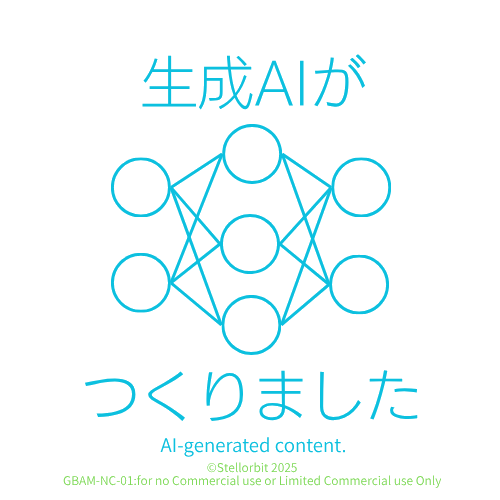

# CapsLockDisabler

## 🌐Generated by AI

**このツールは生成AIツール(Gemini 2.5 Pro)により仕様が決定され、生成されたコードを使用したものです。** 
このマークは自分が作成しました。 
配布ページ https://sites.google.com/view/genbyaimark/

## 🎉New Version:V2
**Added support for English user interface in addition to Japanese.**
日本語に加え、英語のインターフェイスに対応しました。

## ✨ Features / 機能

This tool reassigns the Caps Lock key to function as the left Ctrl key, effectively disabling the original Caps Lock functionality.  
このツールは CapsLock キーを左 Ctrl キーとして再割り当てし、CapsLock の機能を無効化します。  
You can also revert the changes at any time.  
元に戻すことも可能です。

## ⚠️ Notes / 注意事項

- This application must be run with **administrator privileges**.  
  このアプリケーションは **管理者権限** で実行する必要があります。
- After running the application, please **sign out** or **restart** your system for the changes to take effect.  
  実行後は **サインアウト** または **再起動** をしてください。

## 🚀 How to Use / 使用方法

1. Launch `CapsLockDisabler.exe`.  
   `CapsLockDisabler.exe` を起動します。
2. Select a Language and press the Enter key:  
   操作する言語を選び、Enterキーを押します。
   - `1`: 日本語（Japanese）
   - `2`: English（英語）
3. コマンドを選び、Enterキーを押すと、操作は完了します。
   - `1`: 有効化 (CapsLock -> 左Ctrl)
     - Enable (CapsLock -> Left Ctrl)
   - `2`: 無効化 (設定をリセット)
     - Disable (Reset settings)
   - `q`: 終了
     - Quit  
3. Sign out or restart your system to apply the changes.  
   サインアウトまたは再起動で設定が反映されます。
